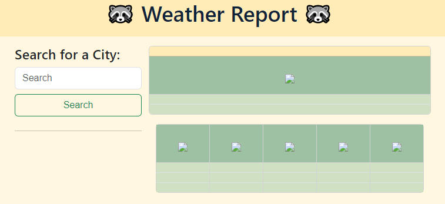
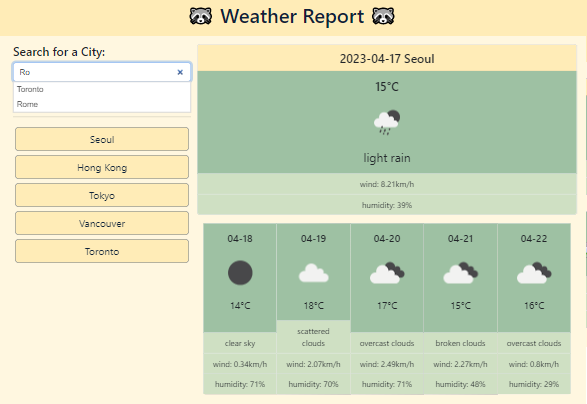

# Weather Dashboard

## 06 Server-Side APIs: Weather Dashboard

The rollercoaster I've been on during this challenge... I started with the skeleton and jquery UI while we were still learning how to use server-side APIs, because I was like maybe I could try getting some of what I SHOULD know how to do done first while I learn the rest of the material! Fast-forward to the due-date and I'm still working on it! By the end of the weekend we learned the how to use the APIs, I had most of it functioning! Which I was really happy about, although not as well as I wanted. So I booked a tutor session to see if I could get the rest of the functionalities I wanted to implement. Unfortunately, after the session I reviewed it, left, and came back after awhile; and I'm not sure what happened but it was gone?? So I was back to where I was before the tutor session, I tried implementing some of it again on my own, but not all of it worked and I was very frustrated, disheartened, and honestly fell into a slump for a few days because of it… But here we are! 

This is my Weather Dashboard! Using the Open Weather API, it will tell you the weather in the city you’re searching! It does this by using 2 APIs provided by Open Weather, one for the geolocation, using the city to get the latitude and longitude; then passing those values onto the weather API to get the weather info! Then using a mix of javascript and jquery, it creates buttons with the cities values saved onto them so you’re able to search them easier!  
 

## Table of Contents

- [Deployment](#deployment)
- [Requirements](#requirements)
- [Usage](#usage)
- [Citations](#citations)
- [License](#license)

## Deployment

Link to my weather dashboard: 

**https://jaychan0125.github.io/Weather-Dashboard/**


## Requirements

Here are the provided requirements:
### User Story
```
AS A traveler
I WANT to see the weather outlook for multiple cities
SO THAT I can plan a trip accordingly
```

### Acceptance Criteria
```
GIVEN a weather dashboard with form inputs
WHEN I search for a city
THEN I am presented with current and future conditions for that city and that city is added to the search history
WHEN I view current weather conditions for that city
THEN I am presented with the city name, the date, an icon representation of weather conditions, the temperature, the humidity, and the wind speed
WHEN I view future weather conditions for that city
THEN I am presented with a 5-day forecast that displays the date, an icon representation of weather conditions, the temperature, the wind speed, and the humidity
WHEN I click on a city in the search history
THEN I am again presented with current and future conditions for that city
```

## Usage



Here you'll find a Weather Dashboard! Please enter the city you're looking for the weather report for in the search input! They'll also be text-complete for some popular city destinations I'd love to travel to! 

 

Once you hit search, the weather dashboard for the current day, the 5-day weather report, and a button with your searched city will populate! You can create a maximum of 6 buttons, so you'll be able to look for the weather in those cities with just a click of the button instead of a whole new search! 


## Citations

Maqsood, A., Moatar, T., Krishna, &amp; Zhang, S. (2023). Web APIs Day 1-3. Lecture. 

Compagnoni, J. (2023). Tutoring.

## License

Licensed under the MIT license.

---

